# **KAFKA NO SPRING BOOT (COM SCHEMA REGISTRY)**
    Estudos e Pesquisas do João Caboclo da S. Filho

        Vídeo aula base do aprendizado: https://www.youtube.com/watch?v=DbkcOpWcMhU
        
        Aprenda a utilizar o Apache Kafka no Spring Boot, mas com um plus, validando as mensagens 
        com o Confluent Schema Registry. Além de utilizar uma das maiores ferramentas de mensageria 
        você também terá mais segurança no tráfego de dados dos seus sistema.
        
        Links:
        Repositório do projeto: https://github.com/felipesilvamelo28/...
        Kafka Docs: https://kafka.apache.org/documentation/
        Apache Avro: https://avro.apache.org/
        Schema Registry: https://docs.confluent.io/platform/cu...
        Spring Kafka: https://docs.spring.io/spring-kafka/r...

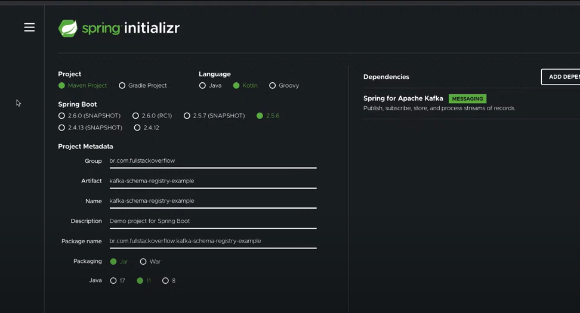

Estrutura do Micro serviço

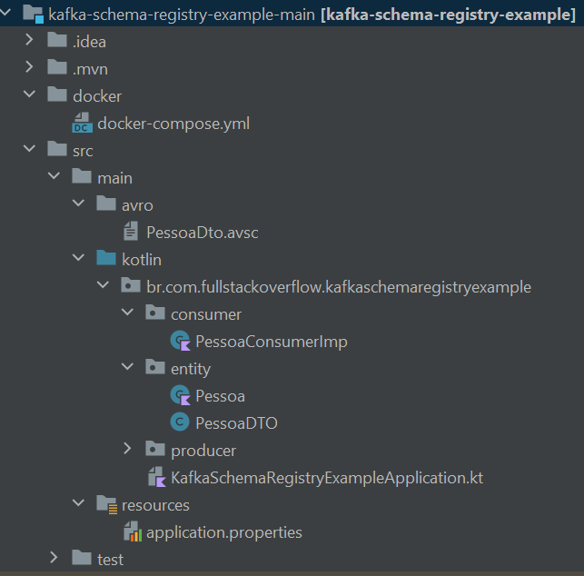

DOCKER-COMPOSER 
   Configurando os serviços necessários no  arquivo:
   docker-compose.yml 

        version: "3.0"
        
        services:
        
        zookeeper:
        image: confluentinc/cp-zookeeper:5.1.2
        restart: always
        environment:
        ZOOKEEPER_SERVER_ID: 1
        ZOOKEEPER_CLIENT_PORT: "2181"
        ZOOKEEPER_TICK_TIME: "2000"
        ZOOKEEPER_SERVERS: "zookeeper:22888:23888"
        ports:
        - "2181:2181"
        
        kafka1:
        image: confluentinc/cp-enterprise-kafka:5.1.2
        depends_on:
        - zookeeper
        ports:
          - "29092:29092"
          environment:
          KAFKA_ZOOKEEPER_CONNECT: "zookeeper:2181"
          KAFKA_LISTENER_SECURITY_PROTOCOL_MAP: PLAINTEXT:PLAINTEXT,PLAINTEXT_HOST:PLAINTEXT
          KAFKA_INTER_BROKER_LISTENER_NAME: PLAINTEXT
          KAFKA_ADVERTISED_LISTENERS: PLAINTEXT://kafka1:9092,PLAINTEXT_HOST://localhost:29092
          KAFKA_ADVERTISED_HOST_NAME: kafka1
          KAFKA_BROKER_ID: 1
          KAFKA_BROKER_RACK: "r1"
          KAFKA_OFFSETS_TOPIC_REPLICATION_FACTOR: 1
          KAFKA_DELETE_TOPIC_ENABLE: "true"
          KAFKA_AUTO_CREATE_TOPICS_ENABLE: "true"
          KAFKA_SCHEMA_REGISTRY_URL: "schemaregistry:8085"
          KAFKA_JMX_PORT: 9991
        
        schemaregistry:
        image: confluentinc/cp-schema-registry:5.1.2
        restart: always
        depends_on:
        - zookeeper
        environment:
        SCHEMA_REGISTRY_KAFKASTORE_CONNECTION_URL: "zookeeper:2181"
        SCHEMA_REGISTRY_HOST_NAME: schemaregistry
        SCHEMA_REGISTRY_LISTENERS: "http://0.0.0.0:8085"
        ports:
          - "8085:8085"
          kafdrop:
          image: obsidiandynamics/kafdrop
          restart: "no"
          ports:
          - "9000:9000"
          environment:
          KAFKA_BROKERCONNECT: "kafka1:9092"
          depends_on:
          - kafka1

Configurando o PRODUTOR e o CONSUMIDOR das mensagens
  para o KAFKA no arquivo application.properties

    O arquivo application.properteis

    #kafka local producer properties
        spring.kafka.producer.bootstrap-servers=localhost:29092
        spring.kafka.producer.client-id=pessoa-producer
        spring.kafka.producer.key-serializer=org.apache.kafka.common.serialization.StringSerializer
        spring.kafka.producer.value-serializer=io.confluent.kafka.serializers.KafkaAvroSerializer
    #kafka local consumer properties
        spring.kafka.consumer.bootstrap-servers=localhost:29092
        spring.kafka.consumer.group-id=pessoa-consumer
        spring.kafka.consumer.auto-offset-reset=latest
        spring.kafka.consumer.key-deserializer=org.apache.kafka.common.serialization.StringDeserializer
        spring.kafka.consumer.value-deserializer=io.confluent.kafka.serializers.KafkaAvroDeserializer
    #kafka schema registry configs
        spring.kafka.properties.schema.registry.url=http://0.0.0.0:8085
        spring.kafka.properties.specific.avro.reader=true
        auto.create.topics.enable=true

    ATENÇÃO
      Configurando atraves do application.properties abre a possibilidade de termos 
      configurações diferentes, por exemplo: application-dev.properties,
      application-qa.properties, application-prod.properties
    
      podendo varias o valor das propriedades, exemplo:
         spring.kafka.producer.bootstrap-servers=localhost:29092 ( mudando o local )

      Via código isto não seria possível

1-executar o arquivo docker-composer 
  Atnção: o DCOKER desktop já deve estar instalado e rodando

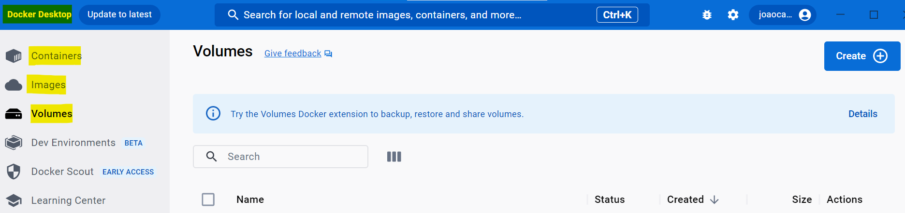

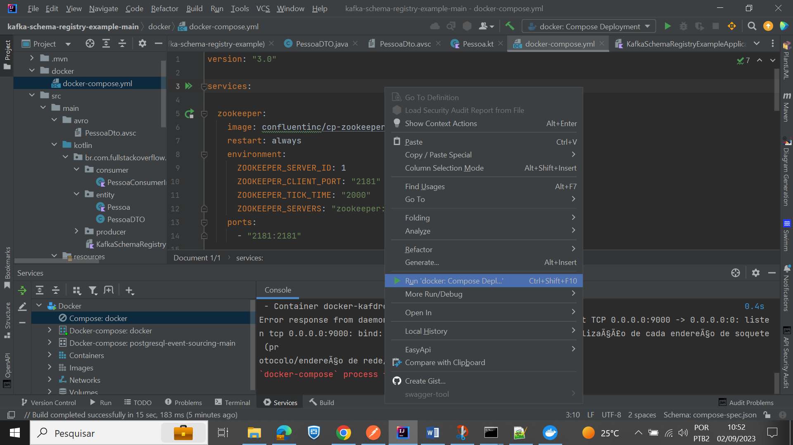

Após rodar o DOCKER-COMPOSER você deverá ter os seguintes serviços rodando

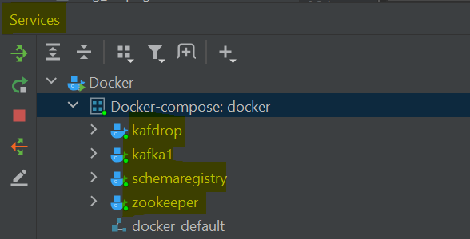

2-O KafkaDrop
  Nós ajudará a criar tópicos e mensagens. Estará acessível na url http://localhost:9000/

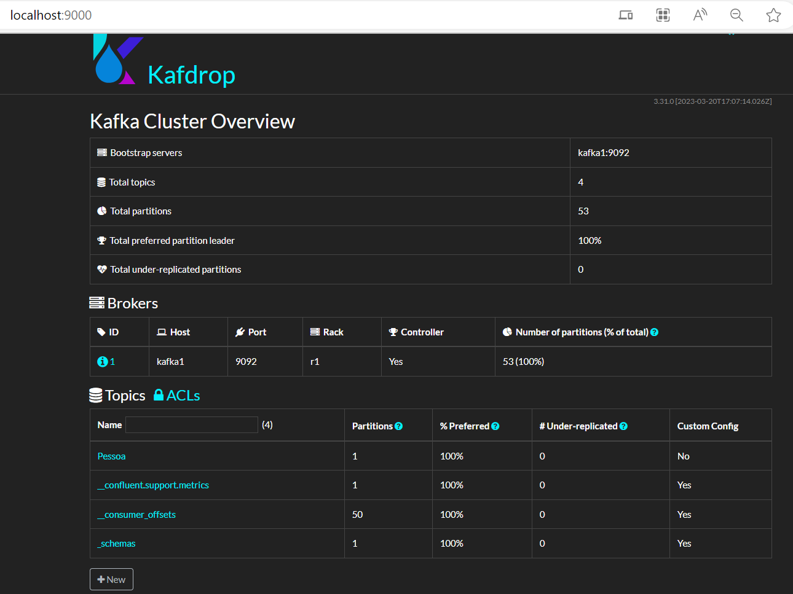

Criando Tópico pelo KafkaDrop

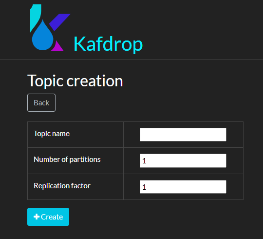

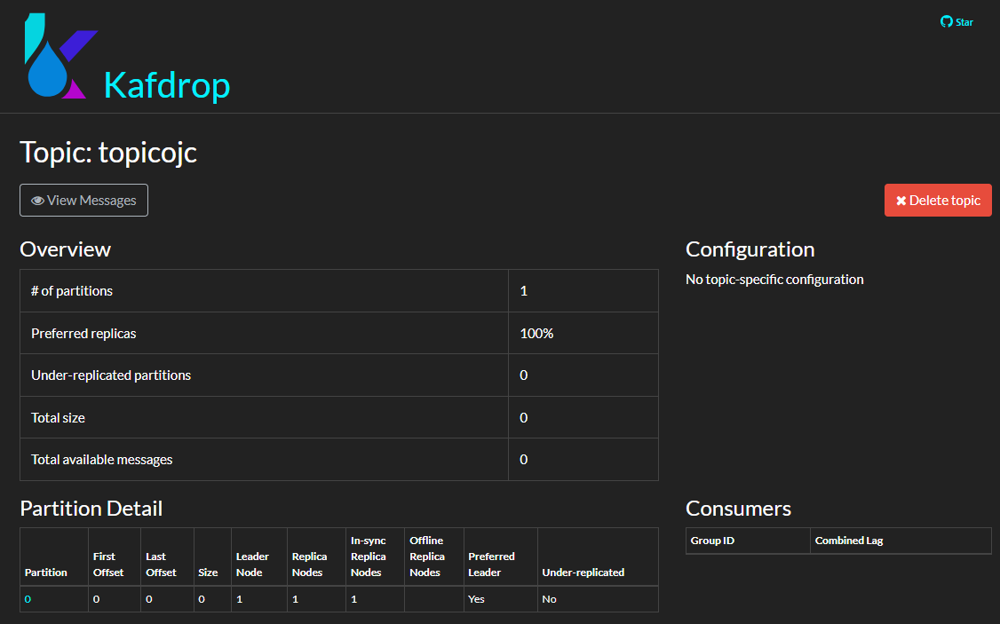

3-Analisando a aplicação - Design

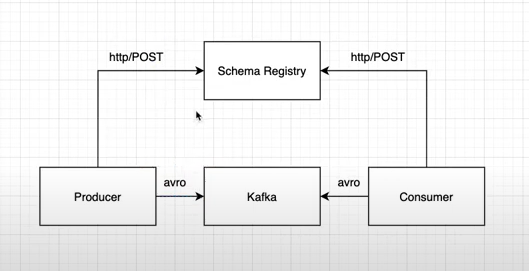

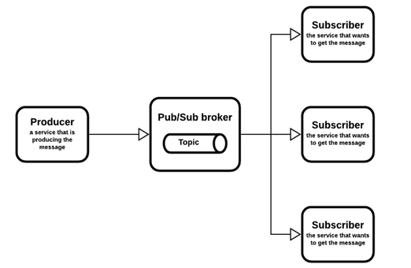

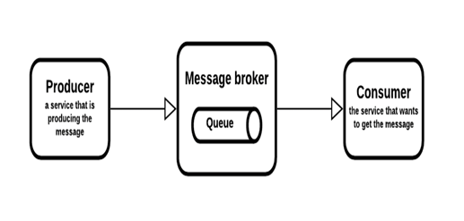

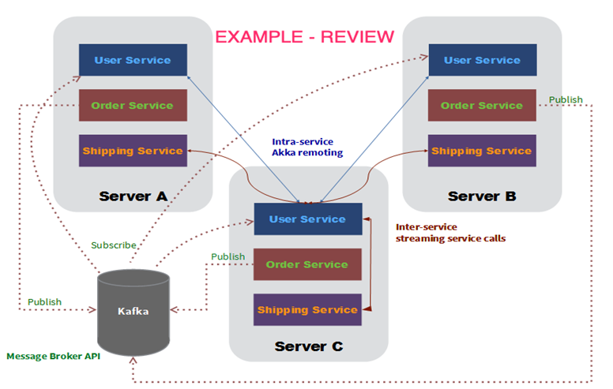

3.0   Configurar o pom.xml para disponibilizar a biblioteca AVRO

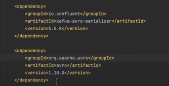
  
Como no MAVEN não existe a biblioteca AVRO, teremos que adicionar também o repositório
onde o AVRO pode ser encontrado para download. Colocar após a tag <buld></build>

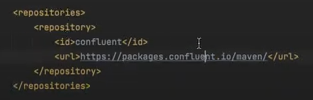

3.1 - Criar a class Pessoa, dentro do pacote Entity.
    package br.com.fullstackoverflow.kafkaschemaregistryexample.entity
    
    data class Pessoa(
    val nome: String,
    val sobrenome: String
    )

3.2 - A class pessoa será a base para acriação do objeto AVRO
   
   Consultar documentação de como criar objetos AVRO
   https://www.codeflow.site/pt/article/java-apache-avro

   Atenção: Escrever no formato JSON, mas a extensão no nome do arquivo deve ser: .avsc
   Então:  PessoaDto.avsc

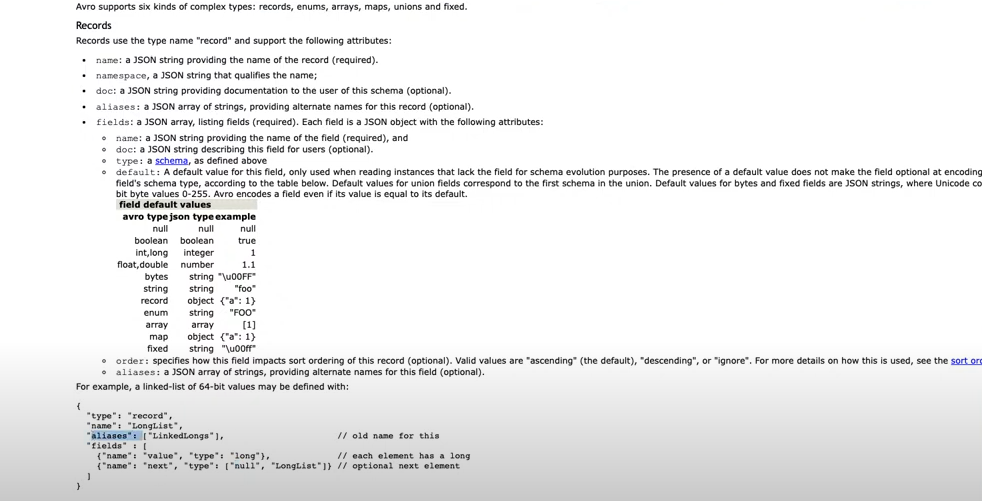

3.3 - O objeto AVRO criado ( na verdade é um objeto no padrão JSON)

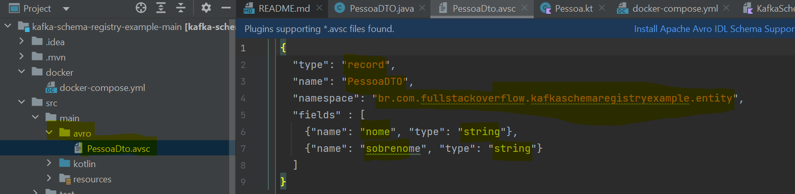

3.4 - Para conver nossa class Pessoa em um PessoaDTO, paseado no arquivo de mapeamento
      AVRO, que criamos, precisaremos configurar um plugin lá no arquivo pom.xml

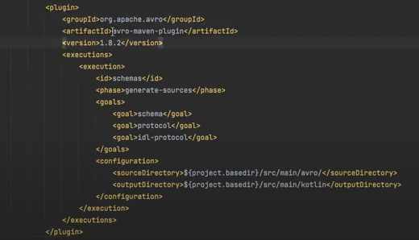

Ao recompilar, ou regerar o código usando o maven generate sources, o DTO será criado automaticamente

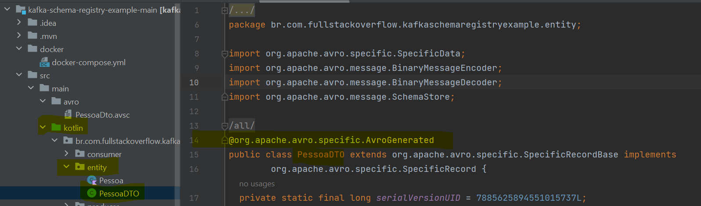

Neste ponto do DTO, está a definição do nosso objeto que será enviado via POST

    public static final org.apache.avro.Schema SCHEMA$ =
        new org.apache.avro.Schema.Parser()
        .parse("{\"type\":\"record\",\"name\":\"PessoaDTO\",\"namespace\":\"br.com.fullstackoverflow
        .kafkaschemaregistryexample.entity\",\"fields\
        ":[{\"name\":\"nome\",\"type\":\"string\"},{\"name\":\"sobrenome\",\"type\":\"string\"}]}");

    // As propriedades
    @Deprecated public java.lang.CharSequence nome;
    @Deprecated public java.lang.CharSequence sobrenome;

4- Criando o PRODUCER
     Pode ser criado via código
     Pode ser criado via application.properties ( detalhe, não pode ser .yml )

     A linha em destaque é para não permitir mensagens duplicadas
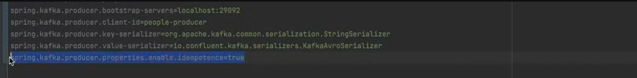

4.2 - Criando o **PessoaProducerConfig** e a class **PessoaProducerImp**

    ** PessoaProducerConfig  **

    package br.com.fullstackoverflow.kafkaschemaregistryexample.producer
    
    import br.com.fullstackoverflow.kafkaschemaregistryexample.entity.PessoaDTO
    import org.springframework.context.annotation.Bean
    import org.springframework.context.annotation.Configuration
    import org.springframework.kafka.core.KafkaTemplate
    import org.springframework.kafka.core.ProducerFactory
    
    @Configuration
    class PessoaProducerConfig {
    
        @Bean
        fun pessoaDTOTemplate(factory: ProducerFactory<String, PessoaDTO>): 
            KafkaTemplate<String, PessoaDTO>
        {
            return KafkaTemplate(factory)
        }
    
    }

    ** PessoaProducerImp **

    package br.com.fullstackoverflow.kafkaschemaregistryexample.producer
    
    import br.com.fullstackoverflow.kafkaschemaregistryexample.entity.Pessoa
    import br.com.fullstackoverflow.kafkaschemaregistryexample.entity.PessoaDTO
    import org.springframework.kafka.core.KafkaTemplate
    import org.springframework.kafka.support.KafkaHeaders
    import org.springframework.kafka.support.SendResult
    import org.springframework.messaging.Message
    import org.springframework.messaging.support.MessageBuilder
    import org.springframework.stereotype.Component
    import org.springframework.util.concurrent.ListenableFuture
    import org.springframework.util.concurrent.ListenableFutureCallback
    import java.time.LocalDate
    
    @Component
    class PessoaProducerImp (private val pessoaTemplate: KafkaTemplate<String, PessoaDTO>
    ){
    
        val topicName = "Pessoa"
    
        fun persist(messageId: String, payload: Pessoa){
            val dto = createDTO(payload)
            sendPessoaMessage(messageId, dto)
        }
    
        private fun sendPessoaMessage(messageId: String, dto: PessoaDTO) {
            val message = createMessageWithHeaders(messageId, dto, topicName)
    
            val future: ListenableFuture<SendResult<String, PessoaDTO>> = pessoaTemplate.send(message)
    
            future.addCallback(object: ListenableFutureCallback<SendResult<String, PessoaDTO>> {
                override fun onSuccess(result: SendResult<String, PessoaDTO>?) {
                    println("Pessoa enviada. MessageId $messageId")
                }
                override fun onFailure(ex: Throwable) {
                    println("Erro no envio. MessageId $messageId")
                }
            })
    
        }
    
        private fun createDTO(payload: Pessoa): PessoaDTO {
            return PessoaDTO.newBuilder()
                .setNome(payload.nome)
                .setSobrenome(payload.sobrenome)
                .build()
        }
    
        private fun createMessageWithHeaders(messageId: String, pessoaDTO: PessoaDTO, topic: String): Message<PessoaDTO> {
            return MessageBuilder.withPayload(pessoaDTO)
                .setHeader("hash", pessoaDTO.hashCode())
                .setHeader("version", "1.0.0")
                .setHeader("endOfLife", LocalDate.now().plusDays(1L))
                .setHeader("type", "fct")
                .setHeader("cid", messageId)
                .setHeader(KafkaHeaders.TOPIC, topic)
                .setHeader(KafkaHeaders.MESSAGE_KEY, messageId)
                .build()
        }
    
    }

5- Criando o PessoaConsumerImp

    package br.com.fullstackoverflow.kafkaschemaregistryexample.consumer
    
    import br.com.fullstackoverflow.kafkaschemaregistryexample.entity.Pessoa
    import br.com.fullstackoverflow.kafkaschemaregistryexample.entity.PessoaDTO
    import org.springframework.kafka.annotation.KafkaListener
    import org.springframework.kafka.annotation.PartitionOffset
    import org.springframework.kafka.annotation.TopicPartition
    import org.springframework.messaging.handler.annotation.Payload
    import org.springframework.stereotype.Component
    
    @Component
    class PessoaConsumerImp {
    
        @KafkaListener(id = "pessoa-consumer",
            topicPartitions = [
                TopicPartition(
                    topic = "Pessoa",
                    partitions = ["0"],
                    partitionOffsets = arrayOf(PartitionOffset(partition = "*", initialOffset = "0"))
                )
            ]
        )
        fun consume(@Payload pessoaDTO: PessoaDTO){
            val pessoa = Pessoa(pessoaDTO.getNome().toString(), pessoaDTO.getSobrenome().toString())
            println("Pessoa recebida")
            println(pessoa.toString())
        }
    
    }

6- Consultando a pessoa enviada no kafkaDrop
   http://localhost:9000/

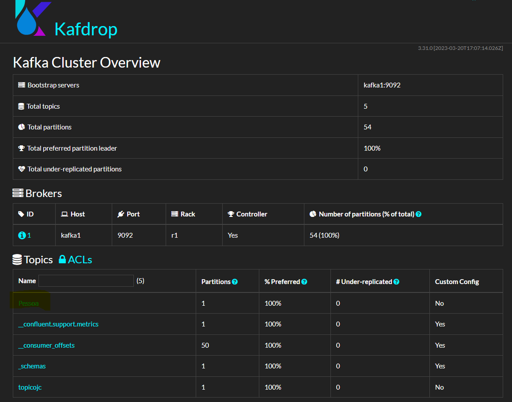

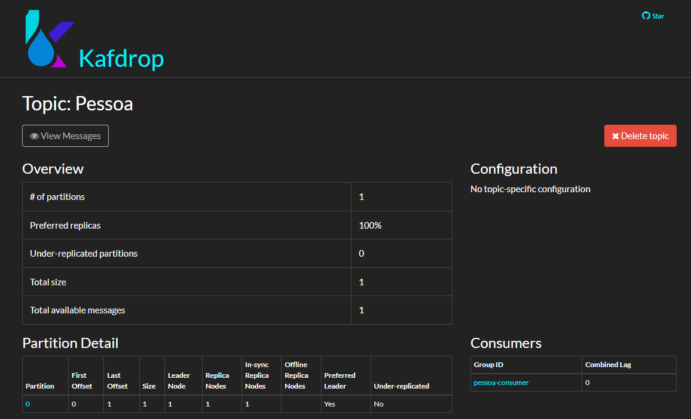

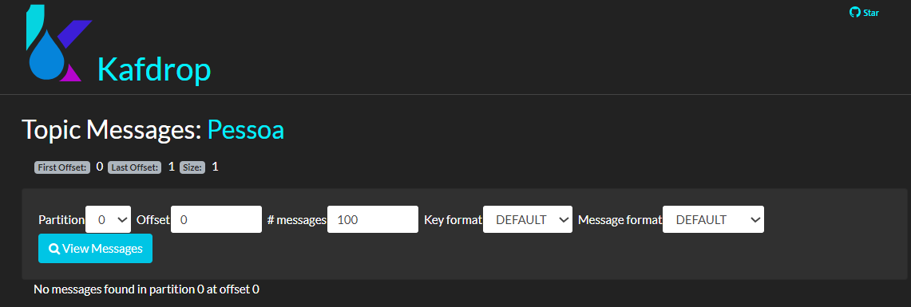

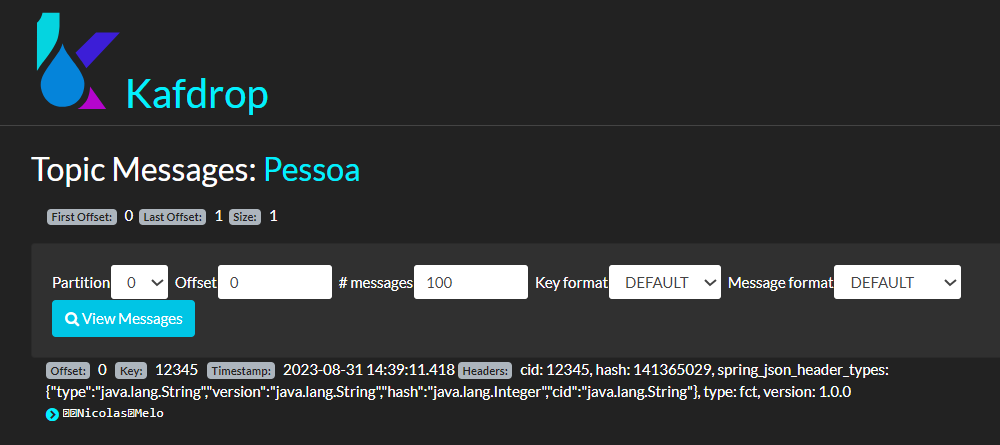

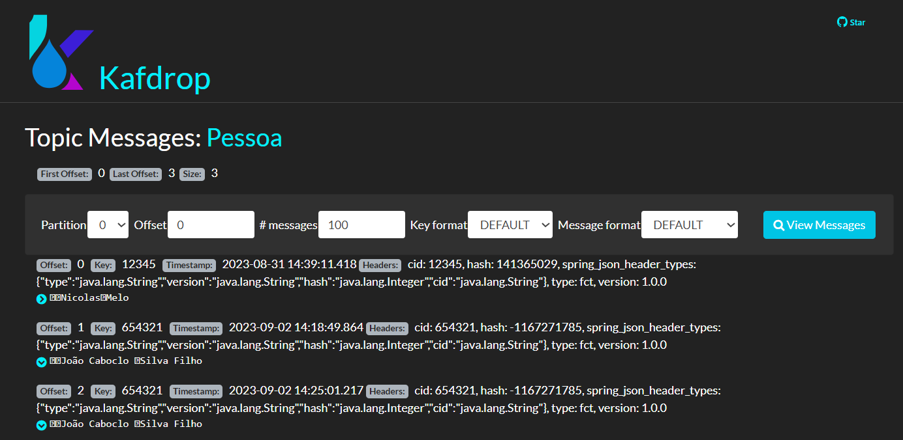

7-Consultando outra mensagem no log do intellij

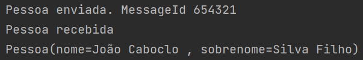

Fim documentação

   
   

